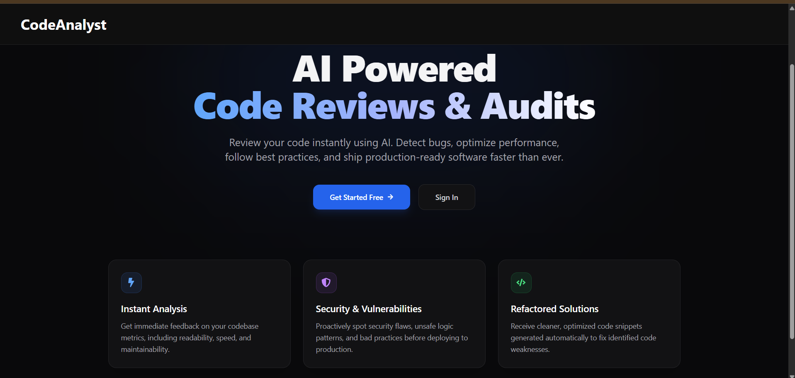
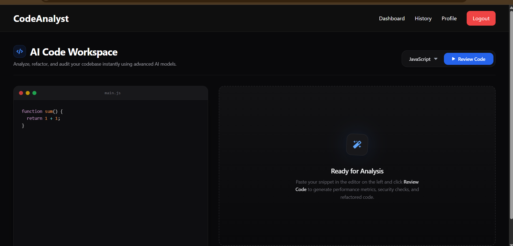
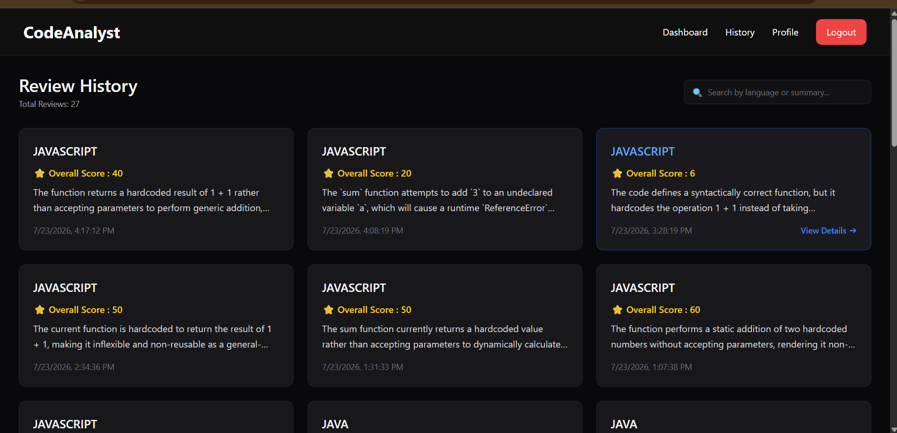
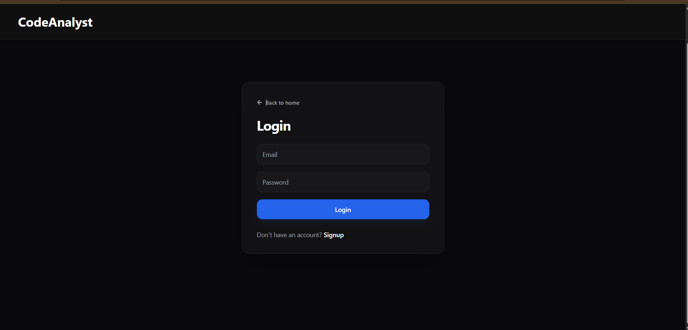

<div align="center">

# 🚀 CodeAnalyst | Enterprise-Grade AI Code Review & Intelligence Platform

> **An advanced, production-ready full-stack SaaS platform designed to automate code quality audits, security vulnerability detection, and architectural refactoring using Google Gemini AI.**

<p align="center">
  
  
  
  
  
</p>

<p align="center">
  <a href="https://code-analyst.vercel.app">🌐 <strong>Live Demo</strong></a> • 
  <a href="https://github.com/nidhi829n/Code-Analyst">💻 <strong>Repository</strong></a> 
</p>

</div>

---

## 💡 Executive Summary

**CodeAnalyst** bridges the gap between static code analysis and cutting-edge generative AI. Built for engineering teams, developer workflows, and technical assessments, it performs real-time multi-language source evaluation, deep vulnerability scanning, performance optimization tracking, and interactive follow-up contextual querying. 

Engineered with enterprise patterns, the backend features rigorous request payload validation, strict rate limiting, enterprise logging tiers, and a robust CI/CD deployment pipeline.

---

## 📸 Visual Showcase

<div align="center">

### 🏠 Landing Page


### 💻 AI Workspace Dashboard


### 📜 Review History & Session Logs


### 🔐 Secure Authentication Suite


</div>

---

## 💎 Architectural Highlights & Engineering Excellence

* **Enterprise Security Hardening**: Implements `Helmet` middleware for HTTP header protection, strict CORS governance, and layer-7 `express-rate-limit` restrictions to mitigate volumetric DDoS and brute-force attacks.
* **Declarative Schema Validation**: Leverages `Zod` validation schemas across all endpoints to guarantee payload integrity before reaching controllers.
* **Centralized Fault Tolerance**: Custom asynchronous handler wrappers combined with global middleware catch-all blocks ensure predictable, standardized JSON error payloads.
* **Dual-Channel Production Logging**: Complete system visibility powered by `Winston` (for persistent multi-transport error logs) paired with `Morgan` (for high-throughput HTTP access tracing).
* **Context-Aware LLM Pipelines**: Structured prompt engineering pipelines interfacing securely with the Google Gemini API to yield deterministic multi-metric evaluations (Security, Readability, Maintainability, and Performance).

---

## 🛠️ Technology Stack Matrix

| Architectural Tier | Selected Technology Stack | Purpose & Rationale |
| :--- | :--- | :--- |
| **Frontend UI/UX** | React.js, Vite | High-performance client rendering, ultra-fast HMR development. |
| **Backend API Engine**| Node.js, Express.js | Non-blocking I/O runtime optimized for asynchronous microservice communication. |
| **Data Layer** | MongoDB Atlas, Mongoose | Schema-flexible document store handling dynamic review objects and histories. |
| **AI Processing** | Google Gemini API | Advanced context-window LLM driving code reviews and chat threads. |
| **Access Control** | JSON Web Tokens (JWT) | Stateless cryptographic session validation across protected routes. |
| **Validation & Safety**| Zod, Helmet, Rate-Limit | Strict schema validation and perimeter defense utilities. |
| **Observability** | Winston, Morgan | Enterprise grade file/console transport logging. |
| **CI/CD & Hosting** | GitHub Actions, Vercel, Render | Automated linting, test validation, and zero-downtime cloud releases. |

---

## 🔄 System Architecture & Data Flow

### High-Level Deployment Topology
```text
        [ Browser Client ]
                │
         HTTPS Requests
                ▼
        [ React Frontend ] (Vercel Edge)
                │
         Axios REST Payload
                ▼
      [ Express API Backend ] (Render Cloud Container)
        ├── Helmet Security Header Layer
        ├── Rate Limiter Barrier
        ├── JWT Cryptographic Verification
        ├── Zod Schema Payload Sanitizer
        └── Async Controller Logic Dispatcher
                │
         ┌──────┴──────┐
         ▼             ▼
  [ Google Gemini ]  [ MongoDB Atlas ]
  AI Intelligence    Persistent Storage

